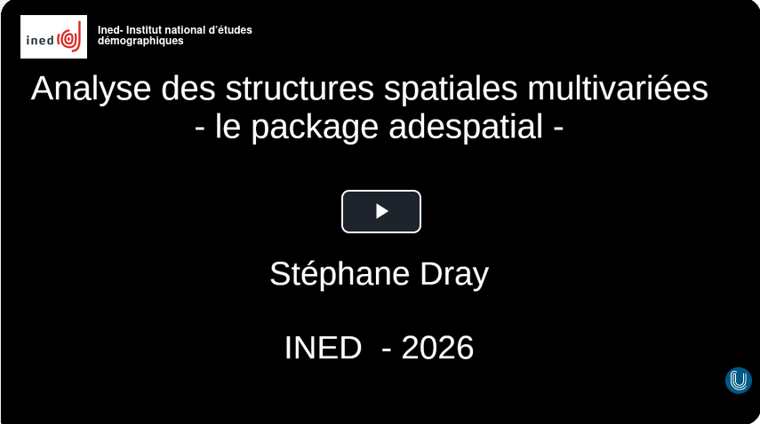

### Résumé

Les méthodes d’analyse multivariée visent à identifier et résumer les principales structures de jeux de données contenant la description d’individus par plusieurs variables. Dans de nombreux cas, de l’information spatiale peut-être également disponible pour chaque observation (e.g., coordonnées géographiques). Il est alors possible d’intégrer ces deux aspects (spatial et multivarié) afin de résumer les structures de covariation entre variables dans l’espace géographique. Dans la pratique, atteindre cet objectif représente un défi statistique et plusieurs méthodes ont été développées afin d’intégrer les contraintes spatiales sous différentes formes (e.g., distance géographique, graphe de voisinage) dans l’analyse multivariée. Cette question méthodologique a été et reste un enjeu majeur en écologie des communautés, où les assemblages d’espèces (c’est-à-dire la covariation entre les abondances des espèces) sont souvent déterminés par des processus spatiaux (e.g., environnement, interactions biotiques, dispersion).

### 💻 Diaporama

::: diapo
<object class="slide" data="support/RUSS_Dray.pdf" type="application/pdf">

<iframe src="https://docs.google.com/viewer?url=your_url_to_pdf&amp;embedded=true" width="20">

</iframe>

</object>
:::

\

<a href="support/RUSS_Dray.pdf" class="btn btn-outline-success" role="button" aria-disabled="true"><i class="bi bi-eye"></i> Consulter en plein écran</a>

\

### 🎬 Captation vidéo

<a href="https://www.canal-u.tv/chaines/ined/analyse-de-donnees-spatiales-et-multivariees-l-autocorrelation-spatiale-multivariee-0"><a/>

La séance est mise à disposition sur la [**chaine canalU du séminaire RUSS**](https://www.canal-u.tv/chaines/ined/analyse-de-donnees-spatiales-et-multivariees-l-autocorrelation-spatiale-multivariee-0). 

